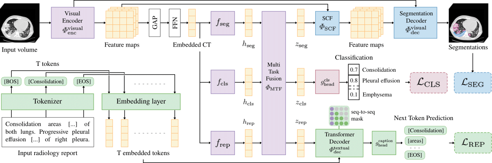

<p align="center">
  <h2 align="center">UniCT: A Unified Joint Multi-Task Framework for 3D Chest CT Abnormality Analysis</h2>
  <h3 align="center"><b>MICCAI 2026</b></h3>
</p>

---

## ✨ Method Overview

  UniCT jointly addresses abnormality classification, 
  segmentation and report generation in a unified approach.



  > #### **UniCT: A Unified Joint Multi-Task Framework for 3D Chest CT Abnormality Analysis**<be>  
  >International Conference on Medical Image Computing and Computer-Assisted Intervention (MICCAI) 2026  
  >Theo Di Piazza, Carole Lazarus, Olivier Nempont, Loic Boussel
  
---

## Notice

This repository is currently under preparation.

---

## 🙌 Acknowledgement

In this work of academic research, UniCT implementation builds upon prior work, including components from [CT-Net](https://github.com/rachellea), [CT-CLIP](https://github.com/ibrahimethemhamamci/CT-CLIP) and [CT2Rep](https://github.com/ibrahimethemhamamci/CT2Rep). We thank the authors of these projects, as well as the contributors of [CT-RATE](https://huggingface.co/datasets/ibrahimhamamci/CT-RATE), [ReXGroundingCT](https://huggingface.co/datasets/rajpurkarlab/ReXGroundingCT) and [RAD-ChestCT](https://zenodo.org/records/6406114) for releasing the datasets to the research community.

---

## Purpose

This code is provided for **academic and research purposes only**, to support reproducibility of the results described in the associated paper. This repository is a research prototype, and is not intended for clinical use.

---

## 📎Citation

If you use this repository in your work, we would appreciate the following citation:

```bibtex
@InProceedings{dipiazza_2026_unict,
        title = {UniCT: A Unified Joint Multi-Task Framework for 3D Chest CT Abnormality Analysis},
      	author = {Di Piazza, Theo and Lazarus, Carole and Nempont, Olivier and Boussel, Loic},
      	booktitle = {International Conference on Medical Image Computing and Computer-Assisted Intervention (MICCAI)},
      	year = {2026},
}
```
